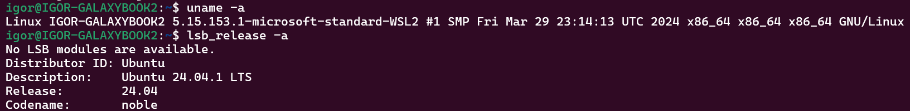
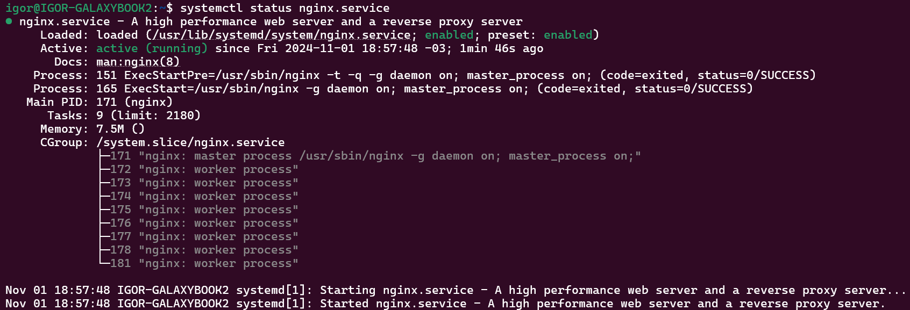
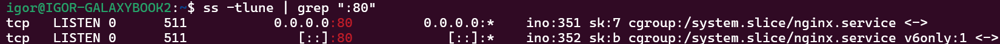
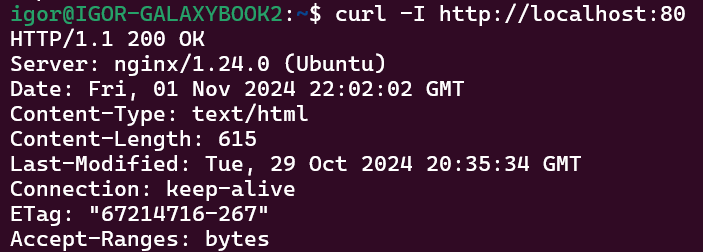
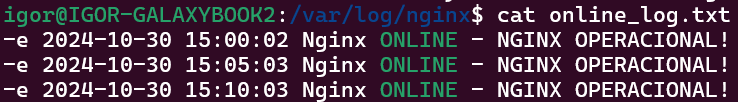
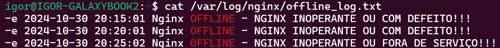

# Criando um ambiente Linux no Windows:
#### Utilizando o WSL do Windows, crie um subsistema do Ubuntu 20.04 ou superior

Para instalar uma distuibuição Linux no Windows através do WSL, basta abrir o PowerShell, e digitar o seguinte commando:

```bash
wsl --install -d Ubuntu
```

O commando `wsl --install -d Ubuntu` realiza a instalação da versão mais recente do Ubuntu LTS.

Para acessar o seu Linux, basta apertar o botão `Win` do Windows e digitar o nome da sua distribuição Linux, que neste caso, é `Ubuntu`.

Acessando pela primeira vez, será necessário criar um usuário e senha de acesso. Após criadas as credenciais, digite os comandos `uname -a` e `lsb_release -a` para ver os detalhes do seu sistema:



Após seguir estes passos, o Linux via WSL está instalado.

# Criando e utilizando um servidor Nginx online e operacional
#### Instalação do Nginx:
```bash
sudo apt install nginx
```

#### Checando status de serviço do Nginx:
```bash
systemctl status nginx.service
```



#### Checando se o Nginx está operacional, filtrando pela porta 80:
```bash
ss -tulne
```



#### Enviar requisição para o servidor
```bash
curl -I http://localhost:80
```



### Criando script que valide se o serviço está online e que envie o resultado da validação para diretório especificado
#### Criando arquivo de extensão .sh (automação em shell script):
```bash
nano nginx_working.sh
```

#### Validando disponibilidade do serviço:
```bash
if systemctl is-active --quiet nginx; then
  log="NGINX OPERACIONAL!"
fi
```

#### Armazenando resultado e tratando permissões:
```bash
log_dir="/var/log/nginx/"
log_file="result.txt"

if [[ ! -d "$log_dir" ]]; then
	echo "nginx_working: DIRETÓRIO $log_dir NÃO ENCONTRADO, CRIANDO DIRETÓRIO"
	sudo mkdir -p "$log_dir"
	sudo chmod 775 "$log_dir"
fi

if [[ ! -w "$log_dir" ]]; then
	echo "nginx_working: ESCRITA NÃO PERMITIDA EM $log_dir, PERMISSÃO NECESSÁRIA PARA PROSSEGUIR"
	sudo chmod 775 "$log_dir"
fi
echo "$log" >> "$log_dir$log_file"
```

#### OBS.: o script deve conter as seguintes informações:
- data e hora
- nome do serviço,
- status
- mensagem personalizada de online ou offline


### Alterando condições para atender novos requisitos:
```bash
if systemctl is-active --quiet nginx; then
  status="ONLINE"
	colored_status="\e[32m$status\e[0m"
  message="NGINX OPERACIONAL!"
else
  status="OFFLINE"
	colored_status="\e[31m$status\e[0m"
  message="NGINX INOPERANTE OU FORA DE SERVIÇO!!!"
fi
```

#### Atualizando o resultado final do script:
```bash
timestamp=$(date "+%Y-%m-%d %H:%M:%S")
log="$timestamp Nginx $colored_status - $message"
echo "$log" >> "$log_dir$log_file"
```

#### > arquivos gerados pelo script (resultado esperado):
- 01 arquivo para o serviço online
- 01 arquivo para o serviço offline

### Criando mensagens diferentes entre os arquivos de saída:
```bash
if systemctl is-active --quiet nginx; then
	status="ONLINE"
	colored_status="\e[32m$status\e[0m"
	message="NGINX OPERACIONAL!"
	log_file="online_log.txt"
else
	status="OFFLINE"
	colored_status="\e[31m$status\e[0m"
	message="NGINX INOPERANTE OU FORA DE SERVIÇO!!!"
	log_file="offline_log.txt"
fi

log_dir="/var/log/nginx/"

if [[ ! -d "$log_dir" ]]; then
	echo "nginx_working: DIRETÓRIO $log_dir NÃO ENCONTRADO, CRIANDO DIRETÓRIO"
	sudo mkdir -p "$log_dir"
	sudo chmod 775 "$log_dir"
fi

if [[ ! -w "$log_dir" ]]; then
	echo "nginx_working: ESCRITA NÃO PERMITIDA EM $log_dir, PERMISSÃO NECESSÁRIA PARA PROSSEGUIR"
	sudo chmod 775 "$log_dir"
fi

timestamp=$(date "+%Y-%m-%d %H:%M:%S")
log="$timestamp Nginx $colored_status - $message"
echo "$log" >> "$log_dir$log_file"
```

### Habilitando a execução automatizada do script para cada 05 minutos:
#### Adicionando script para diretório localizado no PATH para que seja executado sem restrições de diretório:
```bash
sudo cp ./nginx_working.sh /usr/bin
```
#### Elevando a permissão de execução para o script:
```bash
sudo chmod +x nginx_working.sh
```

#### Executando o agendador de tarefas do Linux:
```bash
crontab -e
```

#### Adicionando o seguinte código para executar a tarefa desejada a cada 05 minutos
```bash
*/5 * * * * nginx_working.sh
```
#### Resultado final:





### Realizando versionamento dos códigos do servidor

#### Iniciando um novo repositório:
```
git init
```
#### Adicionando os arquivos para entrarem na fila do commit:
```
git add .
```

#### Realizando o commit:
```
git commit -m "initial commit"
```

#### Renomeando a branch master para main:
```
git branch -M main
```

#### Adicionando o .git do repositório remoto:
```
git remote add origin https://github.com/igor-usr/nginx-server.git
```

### Comando `push` para as alterações na branch main criada:
```
git push -u origin main
```
